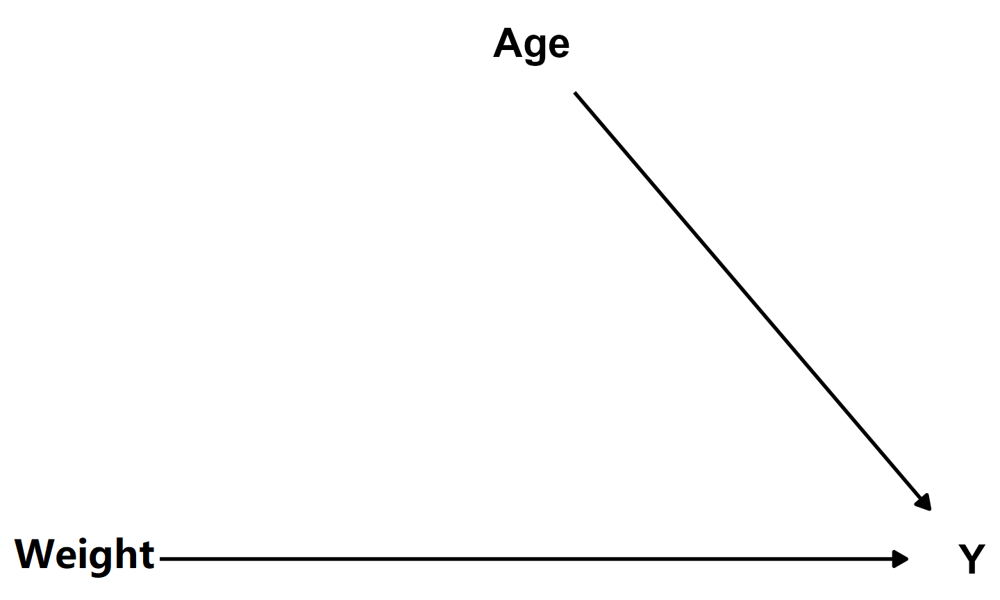

```{r setup, include=FALSE}
knitr::opts_chunk$set(
    echo     = FALSE,
    warning  = FALSE, 
    message  = FALSE,
    fig.asp  = 0.618,
    dpi      = 300
)
options(digits = 3)
```


我们的课程目标：用R语言生成一份完整的word分析报告，内容包括读取数据、基础统计、可视化探索以及建立模型。


```{r libraries, echo = FALSE}
library(tidyverse)
library(gtsummary)
```


# 数据

这里是小学生50米短跑的成绩见表 \@ref(tab:tab01)

```{r, tab.id = "tab01", tab.cap = "小学生50米短跑的成绩"}
d <- read_csv("./data/data-50m.csv")

d %>% 
  slice_head(n = 8) %>% 
  flextable::flextable() %>% 
  flextable::autofit()
```


其中Y代表短跑速度 (m/s)；Weight代表体重 (kg)；Age代表年龄 (year)。


## 基础统计

下面统计小学生50米跑步的平均速度和体重，请见表 \@ref(tab:tabsummary)

```{r, tab.id = "tabsummary"}
d %>% 
  summarise(
    mean_speed = mean(Y),
    mean_weight = mean(Weight)
  ) %>% 
  flextable::flextable() %>% 
  flextable::autofit() %>% 
  flextable::set_caption("平均速度和体重")
```


年龄分布情况见表 \@ref(tab:tabage)

```{r, tab.id = "tabage", tab.cap = "年龄分布情况"}
d %>% 
  mutate(Age = as.factor(Age)) %>% 
  gtsummary::tbl_summary()
```


## 图形探索

体重越大，跑步越慢？想探索这个问题，我们画出体重与速度的关联图，见图 \@ref(fig:figweight)

```{r figweight, fig.cap="体重和速度的关联"}
d %>% 
  ggplot(aes(x = Weight, y = Y)) +
  geom_point(size = 3) +
  theme_classic()
```

接着探索年龄和速度的关系，见图 \@ref(fig:figage)

```{r figage, fig.cap="年龄和速度的关联"}
d %>% 
  ggplot(aes(x = Age, y = Y)) +
  geom_point(size = 3) +
  theme_classic()
```


# 模型 {#models}

我们假定三者满足如下关系，见图 \@ref(fig:fig-relations)

```{r fig-relations, fig.cap= '体重、年龄与跑步速度的关联'}

```

由此建立多元回归模型，这里写出数学表达式

$$
y_n = \alpha + \beta x_n + \epsilon_n
\quad\text{where}\quad
\epsilon_n \sim \operatorname{normal}(0,\sigma).
$$


我们开始用代码实现计算

```{r, echo=TRUE}
mod <- lm(Y ~ Weight + Age, data = d)
```


多元线性回归模型的输出结果见表 \@ref(tab:tabcoef)

```{r, tab.id='tabcoef', tab.cap = "多元线性回归模型系数"}
mod %>% 
  gtsummary::tbl_regression()
```


给出边际效应预测图，见图 \@ref(fig:figcme)

```{r figcme, fig.asp= 0.45, fig.cap="年龄和体重的边际效应图"}
library(marginaleffects)
library(cowplot)

theme_set(theme_classic())

p1 <- mod %>% plot_predictions(condition = "Age") 
p2 <- mod %>% plot_predictions(condition = "Weight")

cowplot::plot_grid(p1, p2)
```


# 结论

从前面第 \@ref(models) 章的分析结论告诉我们，对于小学生而言，随着年龄的增长，体重会增长，肌肉越发达，所以跑步速度会越快。但如果学生超重，那么也会影响速度。以上我的一项重要研究成果，研究方法借鉴大神[@Wilke2019]和[@Wickham2017]的相关文献。


\newpage
# 参考文献 {-}

